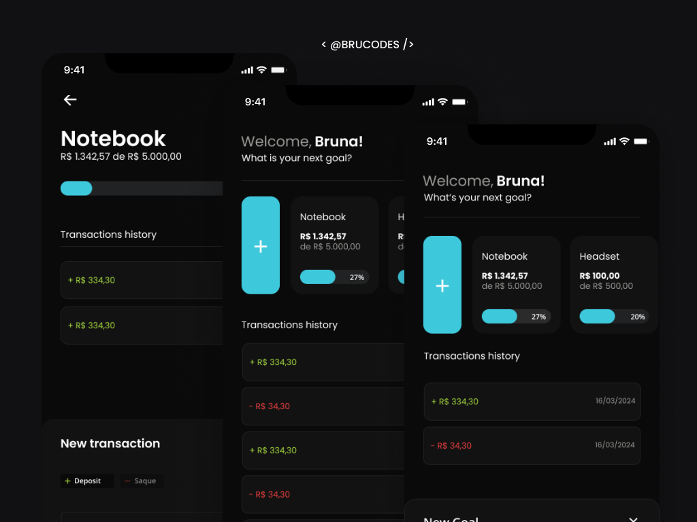

# My Goals 🎯

Personal Finance Goals App: Achieve your financial goals with ease.

My Goals app works as a financial guide, helping you set savings goals and track your progress until you reach your financial targets.

## Technologies

- `React Native`
- `TypeScript`
- `Tailwind CSS`
- `SQLite`
- `Expo`
- `Expo Go`
- `Expo Router` 

## Features

Here's what you can do with MyGoals App:

- **Create Financial Goals:** Personalize your goals by giving them a name and setting the desired amount.
  
- **Deposit Funds:** Easily track your progress by depositing funds into specific goals.

- **Withdrawal:** When needed, withdraw funds from your goals.

- **Progress Percentage:** Keep track of your progress with the percentage completed displayed.

- **Transaction History:** Every transaction is recorded with a timestamp for easy tracking and accountability.

## Running the Project

To run the project in your local environment, follow these steps:

*Dependencies: Node.js, Git, Expo Go, Android Emulator (Android Studio)*

1. Clone the repository to your local machine.
2. Run `npm install` in the project directory to install the required dependencies.
3. Run `npm i` to get the node_modules.
4. Run `npm expo start` to get the project started.
5. Open Expo Go app on your iOS or Android device.
6. Use your mobile device's camera to scan the QRcode.

## Preview

<h1 align="center">
  
</h1>
